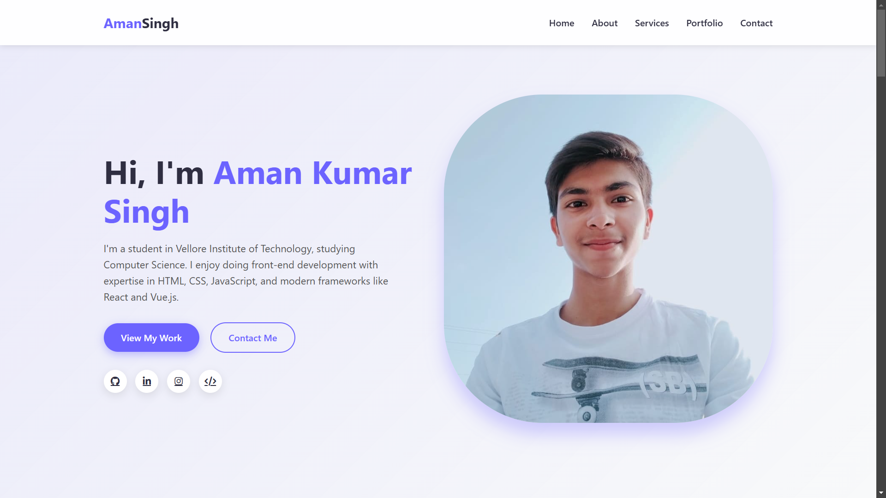

# Aman Kumar Singh - Portfolio Website

 

A modern, responsive portfolio website showcasing my projects, skills, and academic work as a Computer Science student at Vellore Institute of Technology.

## 🌟 Features

- **Responsive Design**: Works on all devices (mobile, tablet, desktop)
- **Interactive Elements**:
  - Smooth scrolling navigation
  - Filterable portfolio gallery
  - PDF assignment viewer
- **Sections**:
  - Hero with animated profile
  - Skills with progress bars
  - Project portfolio
  - Academic assignments
  - Client testimonials
  - Contact form

## 🛠 Technologies Used

- **Frontend**:
  
  
  
- **Tools**:
  
  


## 🚀 How to Run Locally

1. Clone the repository:
   ```bash
   git clone https://github.com/aman-kumar-official/portfolio.git

   cd portfolio
open index.html  

Email: amankumar.singh2023@vitstudent.ac.in

LinkedIn: Aman Kumar Singh

GitHub: aman-kumar-official
